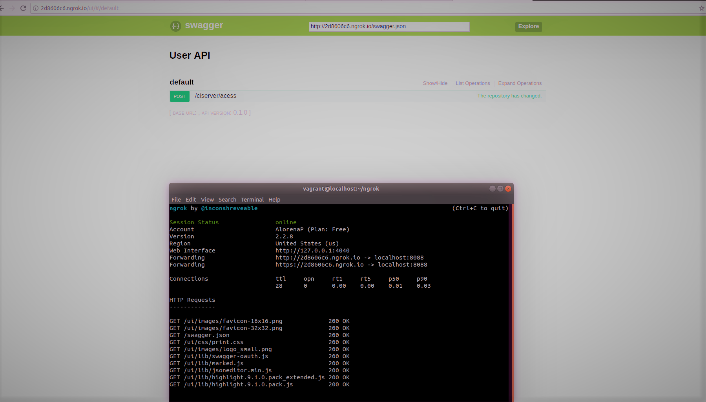

## sd-exam1

**Nombre:** Angie Lorena Pérez    
**Código:** A00242068  
**Materia:** Sistemas distribuidos  
**Correo:** lorena9221@hotmail.com  
**Repositorio:** https://github.com/


## Objectives

* To autonomously carry out the automatic provisioning of infrastructure.
* Diagnose and execute autonomously the necessary actions to achieve stable infrastructures.

### Suggested technologies for the development of the examination
* Vagrant
* Box del sistema operativo CentOS7
* Repositorio Github
* Python3
* Librerias Python3: Flask, Connexion, Fabric
* Ngrok

## Description
You must deploy a platform that meets the following requirements:

You must have a Github repository that corresponds to a fork in the repository **sd2018b-exam1** 
The repository must have a Vagrantfile that allows the deployment of three virtual machines with the following features:
  * CentOS7 DHCP Server
  * CentOS7 CI Server
  * CentOS7 YUM Mirror Server
  * CentOS7 YUM Client
  
   
  
  
  ## Solution

 The following shows the order in which the machines are executed in the Vagrantfile, this through the use of the command ```vagrant up```.
 Each of the machines uses centos1706_v0.2.0

 
 ```
 config.vm.define :dhcp do |dhcp|
  dhcp.vm.box = "centos1706_v0.2.0"
  dhcp.vm.network "public_network", bridge:"eno1", ip:"192.168.130.125", netmask:"255.255.255.0"
  config.vm.provision :chef_solo do |chef|
		chef.install = false
		chef.cookbooks_path = "cookbooks"
		chef.add_recipe "dhcp"
	end
 end

 config.vm.define :mirror_server do |mirror_server|
  mirror_server.vm.box = "centos1706_v0.2.0"
  mirror_server.vm.network "public_network", bridge:"eno1", ip:"192.168.130.10", netmask:"255.255.255.0"
  mirror_server.vm.provision :chef_solo do |chef|
		chef.install = false
  		chef.cookbooks_path = "cookbooks"
    chef.add_recipe "httpd"
		chef.add_recipe "mirror_server"
	end
 end

  config.vm.define :ci_server do |ci_server|
  ci_server.vm.box = "centos1706_v0.2.0"
  ci_server.vm.network :public_network, bridge: "eno1", ip:"192.168.130.3"
  ci_server.vm.provision :chef_solo do |chef|
		chef.install = false
		chef.cookbooks_path = "cookbooks"
 		chef.add_recipe "ci_server"
	end
 end

 
  
  config.vm.define :mirror_client do |mirror_client|
  mirror_client.vm.box = "centos1706_v0.2.0"
  mirror_client.vm.network "public_network", bridge:"eno1", ip:"192.168.130.8", netmask:"255.255.255.0"
  mirror_client.vm.provision :chef_solo do |chef|
		chef.install = false
		chef.cookbooks_path = "cookbooks"
		chef.add_recipe "mirror_client"
	 end
 end
 
 ```
 
 **dhcp configuration:**
 
 In order to install the dhcp service, provisioning is carried out using the chef recipes shown below.
 
 This recipe installs the dhcp service in the machine.
 
 ```
 bash 'dhcp_install' do
  user 'root'
  code <<-EOH
     yum install dhcp -y
    EOH
end
```     

###

This recipe copies the configuration file dhcpd.conf into the path cookbooks/dhcp/files/default

```
  cookbook_file '/etc/dhcp/dhcpd.conf' do
  source 'dhcpd.conf'
  mode '0644'
  owner 'root'
  group 'root'
  action :create
end

```

###

The recipe dhcp_init.rb is responsible for starting the dhcp service. 

```
bash 'dhcp_init' do
  user 'root'
  code <<-EOH
  systemctl start dhcpd.service
  EOH
end

```
 

**Ci server configuration**
The function of this machine is to expose a service through an endpoint. Inside, the virtual machine reads the packages.json file located at the root of the repository.

These are the recipes it contains and in this order are executed
```
include_recipe 'ci_server::list_install'
include_recipe 'ci_server::install_ngrok'
include_recipe 'ci_server::endpoint_conf'
include_recipe 'ci_server::sent_archivos'
```

The following recipe install_ngrok.rb downloads a compressed file from the ngrok page, extracts it to expose the server via a public URL registered in ngrok. The content of the recipe is shown below:

```
bash 'install_ngrok' do
	  code <<-EOH
	     mkdir /home/vagrant/ngrok
	     cd /home/vagrant/ngrok
	     wget https://bin.equinox.io/c/4VmDzA7iaHb/ngrok-stable-linux-amd64.zip
	     unzip ngrok-stable-linux-amd64.zip
	     rm -rf ngrok-stable-linux-amd64.zip
  	  EOH
end
```

So we can verify that he's actually exposing himself.




  
  
  
  
