### Examen 1
**Universidad ICESI**  
**Curso:** Sistemas Distribuidos  
**Docente:** Daniel Barragán C.  
**Tema:** Automatización de infraestructura  
**Correo:** daniel.barragan at correo.icesi.edu.co  
**Estudiante:** Jonatan Ordoñz Burbano  
**Código:** A00054000  
**Repositorio:** https://github.com/JonatanOrdonez/sd2018b-exam1/tree/jordonez/sd2018b-exam1

### Description  
This document describes the configuration of virtual machines to meet the requirements of exam 1 for the course of distributed systems at Icesi University in the 2018b period.

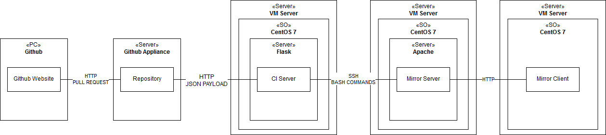  
**Figure 1**. Deployment diagram

### Network Configuration  
For the dhcp_server, yum_mirror_server and ci_server machines, the ips assignment is done manually. Only the yum_client is deployed with an ip assigned by dhcp service in the dhcp_server. The installation of dependencies and files in the virtual machines, a process known as provisioning, is done with the provisioning manager Chef.

| name of the machine | Ip            | Type of assignment |
| ------------------- | ------------- | ------------------ |
| dhcp_server         | 192.168.140.2 | manual             |
| yum_mirror_server   | 192.168.140.3 | manual             |
| ci_server           | 192.168.140.4 | manual             |
| yum_client          | dynamic       | dhcp_server        |
**Table 1**. Network description for the virtual machines

### Deployment description  
The deployment of the machines is done in the following order:
1. dhcp_server
1. yum_mirror_server
1. ci_server
1. yum_client

The order of deployment can be observed in the ``Vagranfile`` file in the root of this repository. Here is the deployment configuration of the Vagrantfile file:

```
config.vm.define "dhcp_server" do |dhcp_server|
 dhcp_server.vm.network "public_network", bridge: "eno1", ip: "192.168.140.2", netmask: "255.255.255.0"
 dhcp_server.vm.provision :chef_solo do |chef|
   chef.install = false
   chef.cookbooks_path = "cookbooks"
     chef.add_recipe "dhcp_server"
     end
end

config.vm.define "yum_mirror_server" do |yum_mirror_server|
 yum_mirror_server.vm.network "public_network", bridge: "eno1", ip: "192.168.140.3", netmask: "255.255.255.0"
 yum_mirror_server.vm.provision :chef_solo do |chef|
   chef.install = false
     chef.add_recipe "yum_mirror_server"
     end
end

config.vm.define "yum_client" do |yum_client|
 yum_client.vm.network "public_network", bridge: "eno1", type: "dhcp"
 yum_client.vm.provision :chef_solo do |chef|
   chef.install = false
   chef.cookbooks_path = "cookbooks"
     chef.add_recipe "yum_mirror_client"
     end
end

config.vm.define "ci_server" do |ci_server|
 ci_server.vm.network "public_network", bridge: "eno1", ip: "192.168.140.4", netmask: "255.255.255.0"
 ci_server.vm.provision :chef_solo do |chef|
   chef.install = false
   chef.cookbooks_path = "cookbooks"
     chef.add_recipe "ci_server"
     end
end
```
We perform the provisioning of the machines by executing the ``vagrant up`` command. Next we will describe the recipes necessary to deploy each machine and its function.

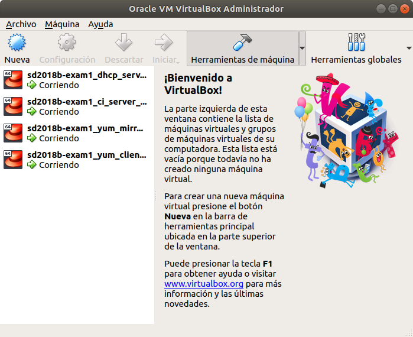  
**Figure 2**. Virtual machines deployed and running.

### dhcp_server  
This virtual machine is the first to be provisioned. This is provisioned with a dhcp service that provides ips in the range 192.168.140.20 to 192.168.140.100.

We can see the order of execution of the recipes in the file ``default.rb`` in the folder ``cookbooks/dhcp_server/recipes``. Here is the content of the file:
```
vi cookbooks/dhcp_server/recipes/default.rb
---
include_recipe 'dhcp_server::dhcp_install'
include_recipe 'dhcp_server::dhcp_conf'
include_recipe 'dhcp_server::dhcp_init'
---
```
The first recipe that is run is ``dhcp_install.rb``. This recipe installs the dhcp service in the machine. Then the contents of the file:
```
vi cookbooks/dhcp_server/recipes/dhcp_install.rb
---
bash 'dhcp_install' do
    user 'root'
    code <<-EOH
        yum install dhcp -y
    EOH
end
---
```
The second recipe that is executed is ``dhcp_conf.rb``. This recipe copies the configuration file ``dhcp.conf`` in the route ``cookbooks/dhcp_server/files/default`` into the machine in the path ``/etc/dhcp``. Here is the content of the files:
```
vi cookbooks/dhcp_server/recipes/dhcp_conf.rb
---
cookbook_file '/etc/dhcp/dhcpd.conf' do
    source 'dhcpd.conf'
    owner 'root'
    group 'root'
    mode '0644'
    action :create
end
---
```

```
vi cookbooks/dhcp_server/files/default/dhcp.conf
---
# dhcpd.conf
#
# Sample configuration file for ISC dhcpd
#

# option definitions common to all supported networks...
# option domain-name "example.org";
# option domain-name-servers ns1.example.org, ns2.example.org;

default-lease-time 600;
max-lease-time 7200;

# Configuring subnet and iprange
 subnet 192.168.140.0 netmask 255.255.255.0 {
 range 192.168.140.20 192.168.140.100;
# Specify DNS server ip and additional DNS server ip
 option domain-name-servers 8.8.8.8;
# Specify Domain Name
# option domain-name "itzgeek.local";
# Default Gateway
 option routers 192.168.130.1;
# option broadcast-address 192.168.140.255;
# Specify Default and Max lease time
 default-lease-time 600;
 max-lease-time 7200;
}
---
```
The last recipe that is executed is ``dhcp_init.rb`` that is responsible for starting the dhcp service from the configuration of the configuration file. Here is the content:
```
vi cookbooks/dhcp_server/recipes/dhcp_init.rb
---
bash 'dhcp_init' do
    user 'root'
    code <<-EOH
        systemctl start dhcpd.service
        systemctl enable dhcpd.service
    EOH
end
---
```
We enter the machine through the command ``vagrant ssh dhcp_server`` and we see that the dhcp service is running with the ``systemctl status dhcp`` command. Below is a picture of the virtual machine with the service running:

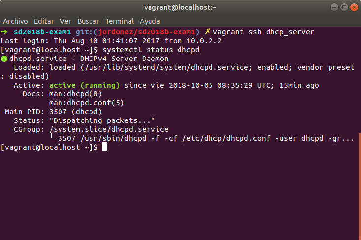  
**Figure 3**. Dhcp status

### yum_mirror_server
This is the second virtual machine that is deployed. This machine is configured as a mirror server that will contain rpms that can be downloaded by the yum_client.

We can see the order of execution of the recipes in the file ``default.rb`` in the folder ``cookbooks/yum_mirror_client/recipes``. Here is the content of the file:
```
vi cookbooks/yum_mirror_server/recipes/default.rb
---
include_recipe 'yum_mirror_server::yum_mirror_server_config'
include_recipe 'yum_mirror_server::yum_mirror_server_copy'
include_recipe 'yum_mirror_server::yum_mirror_server_update'
include_recipe 'yum_mirror_server::yum_mirror_server_install'
---
```
The first recipe is ``yum_mirror_server_config.rb`` in the ``cookbooks/yum_mirror_server/recipes`` path. This recipe configure the virtual machine as a mirror and install openssh  to allows the ci_server to execute commands remotely through ssh. It also installs python to read and load the dependencies from the ``packages.json`` file in the ``cookbooks/yum_mirror_server/files/default`` path. Here is the content of the recipe:
```
vi cookbooks/yum_mirror_server/recipes/yum_mirror_server_config.rb
---
bash 'yum_mirror_server_config' do
    user 'root'
    code <<-EOH
        mkdir /var/repo
        cd /var/repo
        yum install -y httpd
        systemctl start httpd
        systemctl enable httpd
        yum install -y createrepo
        yum install -y yum-plugin-downloadonly
        createrepo /var/repo/
        ln -s /var/repo /var/www/html/repo
        yum install -y policycoreutils-python
        semanage fcontext -a -t httpd_sys_content_t "/var/repo(/.*)?" && restorecon -rv /var/repo
        yum install -y openssh-server openssh-clients
        chkconfig sshd on
        service sshd start
        rm -rf /etc/ssh/sshd_config
        yum install https://centos7.iuscommunity.org/ius-release.rpm -y
        yum install python36 python36u-pip -y
        mkdir /home/vagrant/packages
    EOH
end
---
```
The second recipe that runs is ``yum_mirror_server_copy.rb``. This recipe copies within the virtual machine the ``packages.json`` files containing the dependencies that will be installed in the mirror, ``install_packages.py`` which is a script that is responsible for reading the packages.json file and installing the dependencies and ``sshd_config`` which is the configuration to allow ssh connection from remote systems. Here is the content:
```
vi cookbooks/yum_mirror_server/recipes/yum_mirror_server_copy.rb
---
cookbook_file '/etc/ssh/sshd_config' do
    source 'sshd_config'
    owner 'root'
    group 'root'
    mode '0644'
    action :create
end

cookbook_file '/home/vagrant/packages/packages.json' do
    source 'packages.json'
    owner 'root'
    group 'root'
    mode '0644'
    action :create
end

cookbook_file '/home/vagrant/packages/install_packages.py' do
    source 'install_packages.py'
    owner 'root'
    group 'root'
    mode '0644'
    action :create
end
---
```
The third recipe is ``yum_mirror_server_install.rb``. This receptacle allows to execute the ``install_packages.py`` file that reads the ``packages.json`` file and installs the dependencies inside the virtual machine. The content of the file is shown below:
```
vi cookbooks/yum_mirror_server/recipes/yum_mirror_server_install.rb
---
bash 'yum_mirror_server_install' do
    user 'root'
    code <<-EOH
        cd /home/vagrant/packages
        python3.6 install_packages.py
    EOH
end
---
```
The last recipe is ``yum_mirror_server_update.rb`` that restarts the sshd service with the new configuration. Next the content of the file:
```
vi cookbooks/yum_mirror_server/recipes/yum_mirror_server_update.rb
---
bash 'yum_mirror_server_update' do
    user 'root'
    code <<-EOH
        systemctl reload sshd.service
    EOH
end
---
```
Then we can see the virtual machine with the rpms installed:

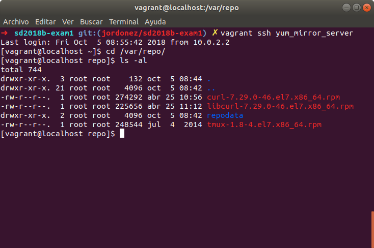  
**Figure 4**. Mirror rpms

### ci_server  
This is the third virtual machine that is deployed. Its function is to expose a service through an endpoint and have it consumed by our github repository through a webhook. In the inside, the virtual machine reads the ``packages.json`` file that is in any pull request to our repository and installs the rpms list of the file in the yum_mirror_server.

We can see the order of execution of the recipes in the file ``default.rb`` in the folder ``cookbooks/ci_server/recipes``. Here is the content of the file:
```
vi cookbooks/ci_server/recipes/default.rb
---
include_recipe 'ci_server::ci_server_install'
include_recipe 'ci_server::ci_server_conf'
include_recipe 'ci_server::ci_server_endpoint_conf'
include_recipe 'ci_server::ci_server_copy'
---
```
The first recipe ``ci_server_install.rb`` installs python, wget, unzip, tmux and vim in the virtual machine to make the other recipes. Here is the content of the recipe:
```
vi cookbooks/ci_server/recipes/ci_server_install.rb
---
bash 'ci_server_install' do
    user 'root'
    code <<-EOH
        yum install https://centos7.iuscommunity.org/ius-release.rpm -y
        yum install python36 python36u-pip -y
        yum install wget -y
        yum install unzip -y
        yum install tmux -y
        yum install vim -y
    EOH
end
---
```
The following recipe ``ci_server_conf.rb`` downloads a compressed file from the ngrok page, extracts it in order to expose our endpoing through a public url and register the ngrok with a token. The content of the recipe is shown below:
```
vi cookbooks/ci_server/recipes/ci_server_conf.rb
---
bash 'ci_server_conf' do
    user 'root'
    code <<-EOH
        cd /home/vagrant
        mkdir ngrok
        cd ngrok
        wget https://bin.equinox.io/c/4VmDzA7iaHb/ngrok-stable-linux-amd64.zip
        unzip ngrok-stable-linux-amd64.zip
        ./ngrok authtoken 63LNouz3BCPNwndPzTJXJ_37e96pM37TzqagbiXiEhZ
    EOH
end
---
```
The following recipe ``ci_server_endpoint_conf.rb`` installs the libraries of python ``fabric`` that will execute the command in ``yum_mirror_server`` through SSH, ``connexion`` that allows to create api REST decoupling the definition of the endpoint of the implementation and ``pygithub`` which is an api that allows to perform operations with github repositories. Next the content of the file:
```
vi cookbooks/ci_server/recipes/ci_server_endpoing_conf.rb
---
bash 'ci_server_endpoint_conf' do
    user 'root'
    code <<-EOH
        pip3.6 install connexion
        pip3.6 install fabric
        pip3.6 install pygithub
        cd /home/vagrant
	      mkdir endpoint
	      cd endpoint
	      mkdir scripts
	      mkdir gm_analytics
	      mkdir gm_analytics/swagger
    EOH
end
---
```
The last recipe is ``ci_server_copy.rb``. This recipe copies the files ``handlers.py``, ``indexer.yaml``, ``deploy.sh`` and ``requirements.txt`` in the path ``/home/vagrant/endpoint`` inside the virtual machine. This recipe copies the necessary modules to raise an endpoint associated with a REST service of POST type that the webhook of our repository consumed through ngrok, and that sends important information to detect our pull request and most importantly, the contents of the package.json file.The following is the content of the recipe:
```
vi cookbooks/ci_server/recipes/ci_server_endpoint_conf.rb
---
cookbook_file '/home/vagrant/endpoint/scripts/deploy.sh' do
    source 'deploy.sh'
    owner 'root'
    group 'root'
    mode '0644'
    action :create
end

cookbook_file '/home/vagrant/endpoint/requirements.txt' do
    source 'requirements.txt'
    owner 'root'
    group 'root'
    mode '0644'
    action :create
end

cookbook_file '/home/vagrant/endpoint/gm_analytics/handlers.py' do
    source 'handlers.py'
    owner 'root'
    group 'root'
    mode '0644'
    action :create
end

cookbook_file '/home/vagrant/endpoint/gm_analytics/swagger/indexer.yaml' do
    source 'indexer.yaml'
    owner 'root'
    group 'root'
    mode '0644'
    action :create
end
---
```

After configuring ngrok correctly and raising our api through the connexion library, you can observe the following:

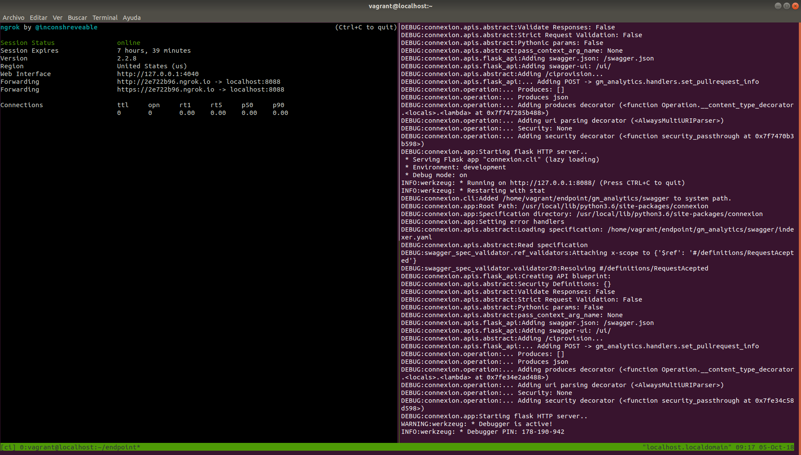  
**Figure 5**. Ci server working

Through the public address http://2e722b96.ngrok.io or https://2e722b96.ngrok.io you can access the services of our virtual machine.

Now we go to the ``configuration`` of our github repository and configure a webhook so that all the events generated when doing a pull request, consume our exposed endpoint through the public ip and send the corresponding information of the pull request. In the image you can see the configuration of the webhook:

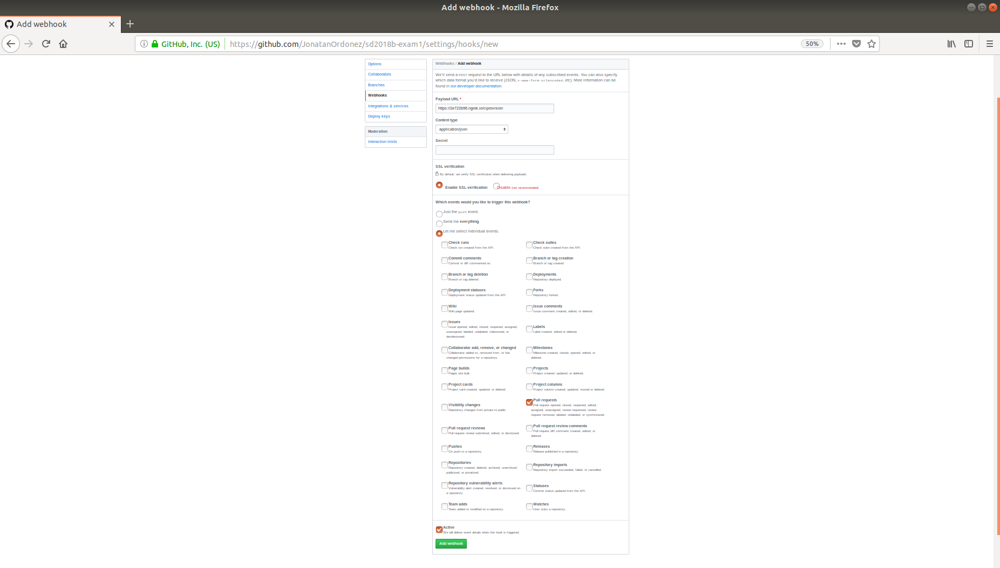  
**Figure 6**. Webhook configuration

To verify that the service is running correctly, we perform a pull request to our Upstream and note that the ``ci_server`` is connected by SSH to the ``yum_mirror_server`` and installs the list of packages contained in the ``packages.json`` file. In the image below it is possible to see the installation clearly:

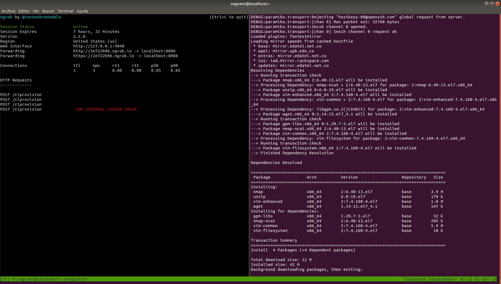  
**Figure 7**. ci_server installing packages in yum_mirror_server

On the other hand, we can see that our continuous integration service ``ci_server`` installed the packages correctly and through the pygithub library it merges the pull request automatically:

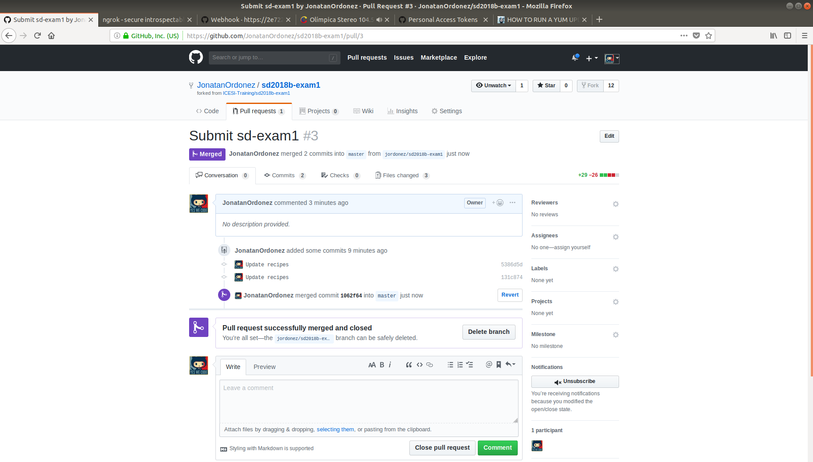  
**Figure 8**. ci_server merge the pull request

**Important:** Below is the python module that is responsible for running the entire continuous integration process:
```
vi cookbooks/ci_server/files/default/handlers.py
---
import logging
import os
import json
from flask import request
import requests
from fabric import Connection
from github import Github

#level = int(os.getenv('LOG_LEVEL'))
#logging.basicConfig(level=level)

def set_pullrequest_info():
    logging.info('executing set_pullrequest_info method')
    data_clean = request.get_data() # get data parameter as json
    data_str = str(data_clean, 'utf-8') # parse json in string format
    data_json = json.loads(data_str) # parse data string to json
    pull_sha = data_json['pull_request']['head']['sha'] # get pull request id from json
    url_pull = 'https://raw.githubusercontent.com/JonatanOrdonez/sd2018b-exam1/' + pull_sha + '/packages.json' # generate url
    response_pull = requests.get(url_pull) # get from url for obtain packages.json
    packages_clean = json.loads(response_pull.content) # load packages.json in json var
    packages_list = packages_clean['packages'] # list of packages
    c = Connection(host='vagrant@192.168.140.3', port=22, connect_kwargs={"password": 'vagrant'}) # initial config for SSH connection with fabric
    cadena = ''
    for package in packages_list:
      cadena = cadena + ' ' + package
    result = c.run('sudo yum install --downloadonly --downloaddir=/var/repo' + cadena) # execute command for install packages in yum_mirror_server
    g = Github("9a4263d973477963e9a4c3b0cf65b2f6e86572f5") # get a reference of my own github using an api token
    repo = g.get_repo("JonatanOrdonez/sd2018b-exam1") # get the JonatanOrdonez/sd2018b-exam1 repository
    pull_number = data_json['pull_request']['number'] # get the pull request number
    pr = repo.get_pull(pull_number) # get the pull request
    if pr.merged: # validation if the pull request was merged
        return {'status': 'Pull request is already merged'}
    elif result.return_code == 0: # validation if the packages were installed correctly
        pr.merge() # merge the pull request
        return {'status': 'Pull request success'}
    elif result.return_code != 0: # validation if the packages were not installed correctly
        return {'status': 'Pull request rejected'}
    else:
        return {'status': 'Error trying to process the request'}
---
```
In the following image you can see how the webhook receives a message from the service that the process of installing the packages was successful:

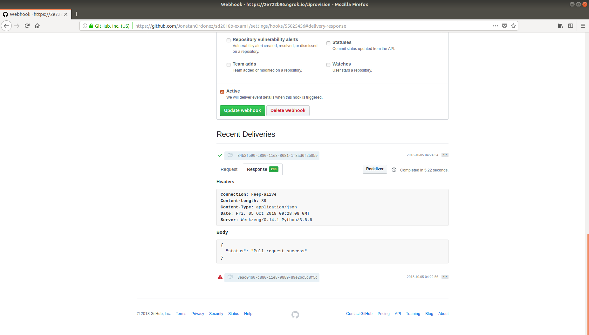  
**Figure 9**. webhook response from ci_server service

Returning to the ``yum_mirror_server``, we can see in the following image that our rpms were added and this virtual machine. This indicates that the continuous integration service installs remotely the new packages contained in a list of the packages.json file:

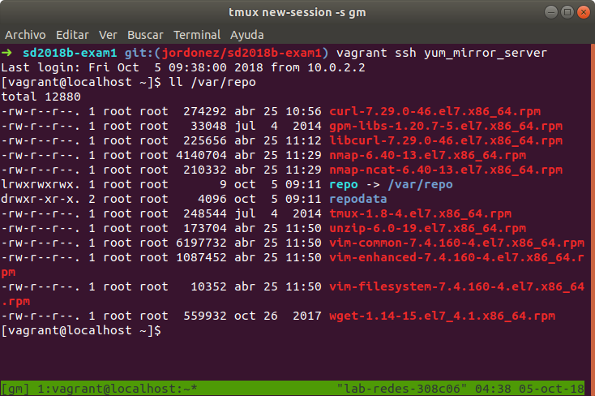  
**Figure 10**. yum_mirror_server with new rpms

### yum_client
The last virtual machine that is deployed is the ``yum_client``. This machine is provisioned with the necessary files to detect ``yum_mirror_server`` as a mirror server from which rpms can be downloaded.

We can see the order of execution of the recipes in the file ``default.rb`` in the folder ``cookbooks/yum_mirror_client/recipes``. Here is the content of the file:
```
vi cookbooks/yum_mirror_client/recipes/default.rb
---
include_recipe 'yum_mirror_client::yum_mirror_client_conf'
include_recipe 'yum_mirror_client::yum_mirror_client_copy'
include_recipe 'yum_mirror_client::yum_mirror_client_update'
---
```
The first recipe is ``yum_mirror_client_conf.rb``. This recipe removes the hosts file in the path ``/etc/`` to provision a new hosts file with the ip of the ``yum_mirror_server`` and an associated URL.
```
vi cookbooks/yum_mirror_client/recipes/yum_mirror_client_conf.rb
---
bash 'yum_mirror_client_conf' do
    user 'root'
    code <<-EOH
        rm -rf /etc/hosts
    EOH
end
---
```
The second recipe is ``yum_mirror_client_copy.rb`` that copies the hosts and ``icesi.repo`` files inside the virtual machine. Next the content of the recipe:
```
vi cookbooks/yum_mirror_client/recipes/yum_mirror_client_copy.rb
---
cookbook_file '/etc/hosts' do
    source 'hosts'
    owner 'root'
    group 'root'
    mode '0644'
    action :create
end

cookbook_file '/etc/yum.repos.d/icesi.repo' do
    source 'icesi.repo'
    owner 'root'
    group 'root'
    mode '0644'
    action :create
end
---
```
The last recipe is ``yum_mirror_client_update.rb`` which is responsible for cleaning the list of repositories and making an updated download of these to get the latest versions of rpms. In the following image the contents of the recipe:
```
vi cookbooks/yum_mirror_client/recipes/yum_mirror_client_update.rb
---
bash 'yum_mirror_client_update' do
    user 'root'
    code <<-EOH
        yum clean all
        yum repolist
        yum update -y
        yum --disablerepo="*" --enablerepo="icesirepo" list available
    EOH
end
---
```
when executing the command ``yum repolist`` we can see that ``icesirepo`` is already loaded and has content of some rpms that were those that were loaded with the previous procedures. In the following image we see the repository we have added:

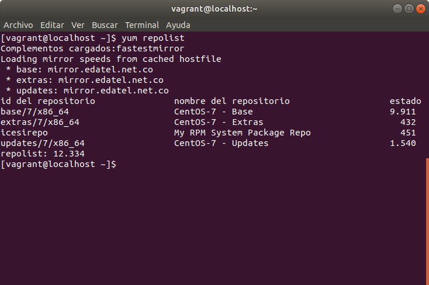  
**Figure 11**. list of repos

In the next image we make a test by downloading the nmap package from icesi repo. We can see that the download is successful, which confirms that all the other provisions including the internal processes are carried out successfully:

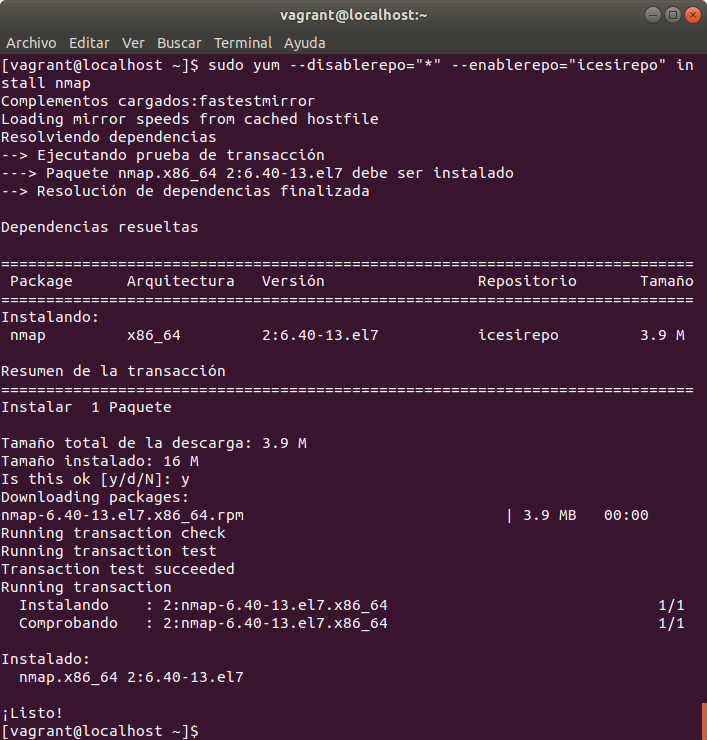  
**Figure 11**. install nmap
